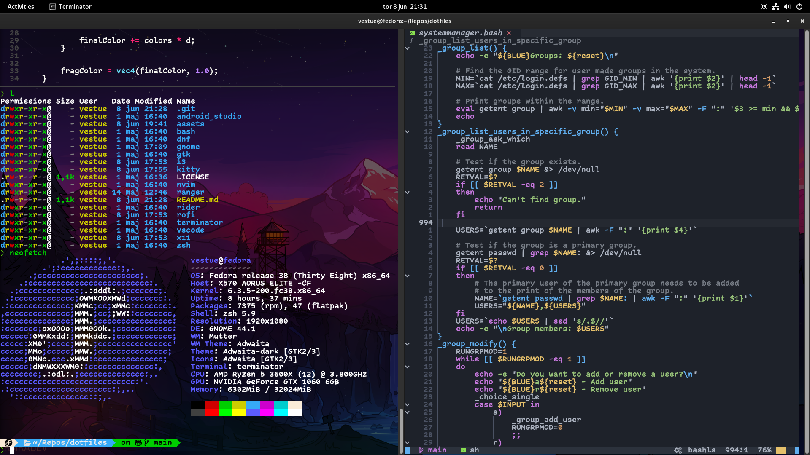

# My dotfiles

A collection of my personal configuration files.

## Screenshots

### GNOME

|Terminator with oh-my-zsh and powerlevel10k|Neovim using AstroNvim|
|-|-|

## Specifications

### Neovim

I currently use AstroNvim as the base for the config as it allows me to have an IDE-like experience in Neovim without any headaches.

- [AstroNvim](https://github.com/AstroNvim/AstroNvim)
- [Personal configuration](https://github.com/Vestue/astronvim_config)

### Zsh

The zsh config consists of plugins which increase quality of life and make things pretty:

- [ohmyzsh](https://github.com/ohmyzsh/ohmyzsh)
- [Powerlevel10k](https://github.com/romkatv/powerlevel10k)
- [autojump](https://github.com/wting/autojump)
- [zsh-syntax-highlighting](https://github.com/zsh-users/zsh-syntax-highlighting)

### Terminator

I use terminator as my main terminal emulator as I like the preconfigured keybindings for splitting windows and managing them.
My terminator setup has been configured to use transparent backgrounds and the [Comic Code](https://tosche.net/fonts/comic-code) font.
